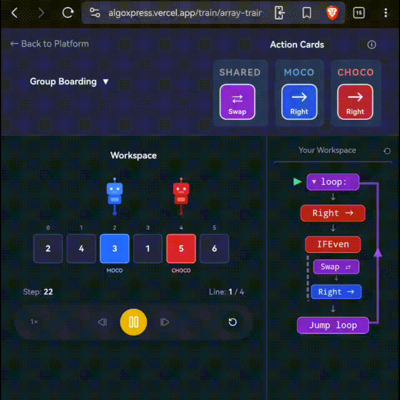
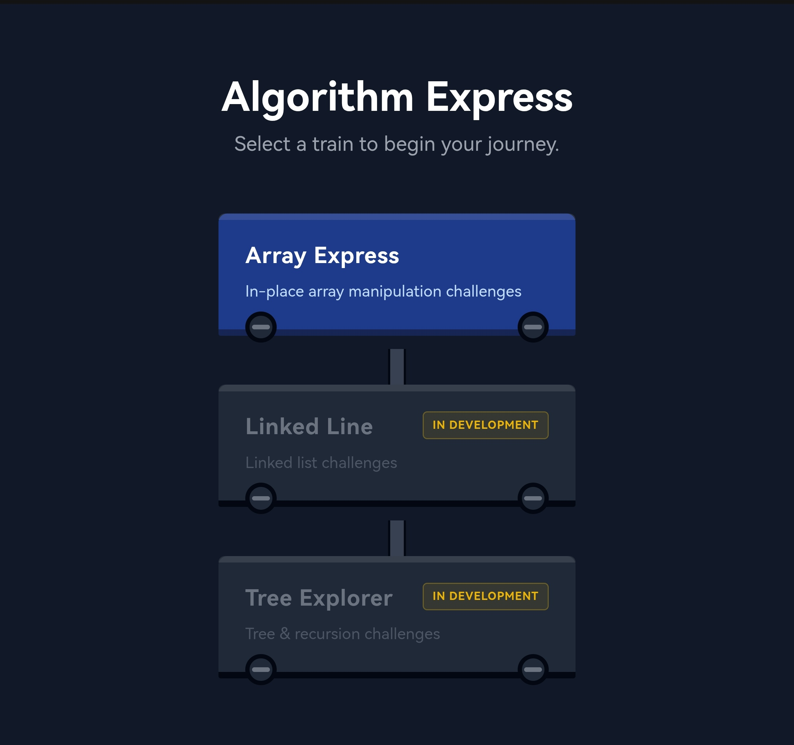
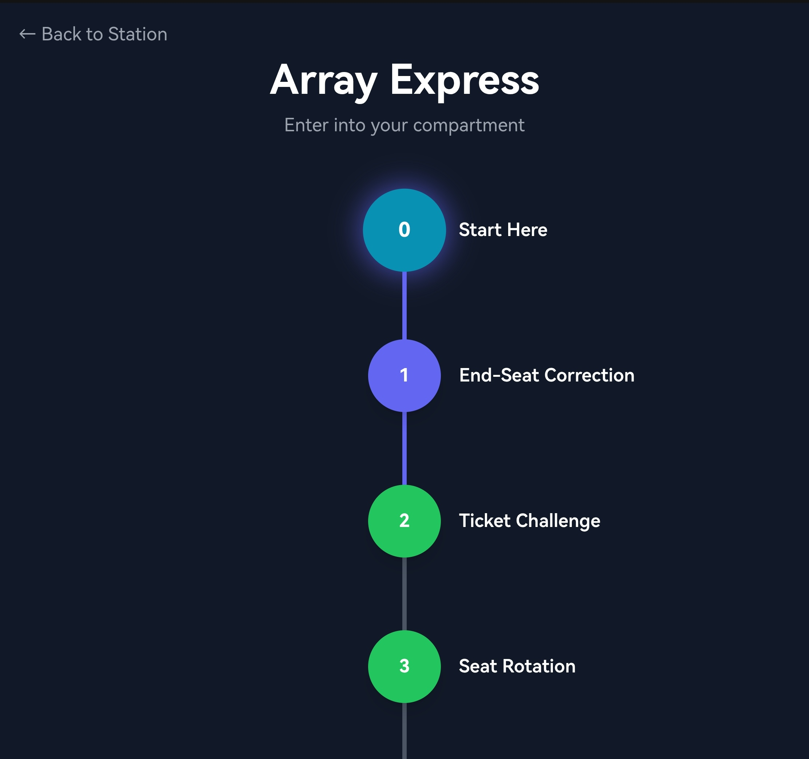
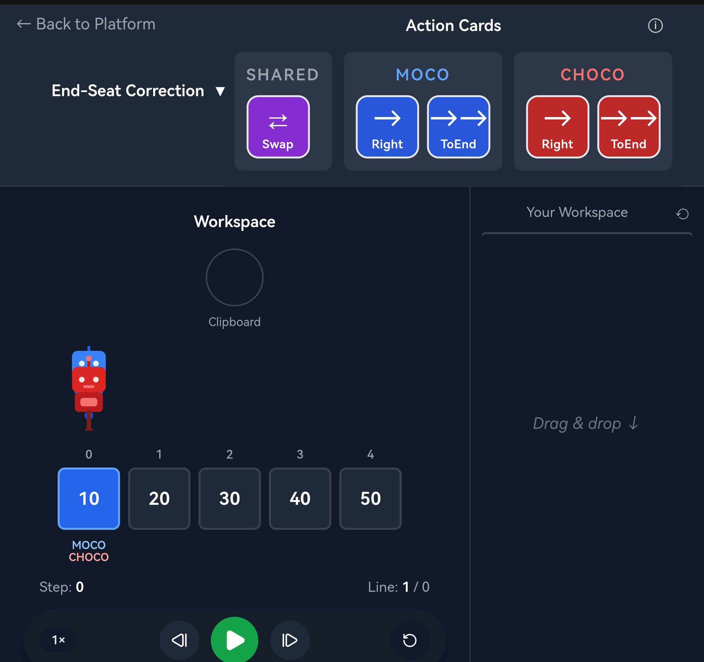

# AlgoXpress

<p align="center">
  
</p>

<h3 align="center">
Interactive DSA Learning Platform
</h3>

<p align="center">
Learn algorithmic thinking through visual execution instead of syntax.
</p>

<p align="center">
  
  
  
  
  
</p>

---

## Live Demo

**Website:** https://algoxpress.vercel.app

**Instagram:** https://www.instagram.com/algoxpress/

---

# Overview

AlgoXpress is an interactive learning platform designed to help beginners understand **how algorithms work internally** before learning programming syntax.

Instead of solving problems by writing JavaScript, C++, or Python, users solve algorithm challenges by assembling visual instructions and watching each operation execute step by step.

The goal is to develop intuition for:

- Algorithm execution
- State transitions
- Pointer movement
- Memory changes
- Logical reasoning

before moving to traditional coding platforms like LeetCode.

---

# Demo

<p align="center">
  
</p>

---

# Features

### 1. Interactive Instruction Programming

Build algorithms using visual instructions instead of traditional code.

### 2. Step-by-Step Execution

Watch every instruction execute one state at a time.

### 3. Replay & Time Travel

- Play
- Pause
- Step Forward
- Rewind

Every execution can be replayed from any point.

### 4. Visual State Inspection

Understand exactly how algorithms transform data through visual state changes.

### 5. Pointer Visualization

Track pointer movement throughout execution.

### 6. Modular Game Challenges

Each challenge is built around a deterministic execution engine with custom validation rules.

### 7. Beginner-Focused Learning

AlgoXpress teaches **algorithmic thinking first**, helping learners build intuition before focusing on syntax.

---

# Technical Highlights

- Custom instruction interpreter written in TypeScript
- Deterministic execution engine
- Replayable execution history
- Web Worker execution pipeline
- Modular architecture separating execution, rendering, and state management

---

# Tech Stack

## Frontend

- React
- TypeScript
- Vite
- Tailwind CSS
- Framer Motion

## State Management

- Zustand

## Execution Engine

- Custom TypeScript Interpreter

---

# Engineering Challenges

Building AlgoXpress involved solving several engineering problems:

- Designing a deterministic instruction execution engine
- Maintaining replayable execution history
- Keeping rendering independent from execution logic
- Running algorithms without blocking the UI using Web Workers
- Synchronizing animations with interpreter execution
- Creating an extensible instruction system for future DSA topics

---

# Current MVP

Currently supports:

- Interactive array challenges
- Instruction-based execution
- Replay system
- Step execution
- Automatic execution
- Execution rewind
- Pointer visualization
- State inspection

---

# Roadmap

## Completed

- Array visualization
- Custom interpreter
- Execution engine
- Replay system
- SVG renderer
- Instruction editor

## In Progress

- In-place array replacement
- Linked List visualization
- Tree visualization

## Planned

- Graph visualization
- Sorting algorithms
- Stack & Queue challenges
- Hash Maps
- Binary Search
- Dynamic Programming visualizations
- More beginner learning paths

---

# Screenshots

## Gameplay

<p align="center">
  
</p>

<p align="center">
  
</p>

<p align="center">
  
</p>

---

# Project Structure

```
src/
├── app/
├── auth/
├── engine/
├── hooks/
├── interpreter/
├── orchestrator/
├── renderer/
├── styles/
├── ui/
└── utils/
```

---

# Local Development

Clone the repository

```bash
git clone <repo-url>
cd algoxpress
```

Install dependencies

```bash
npm install
```

Start development server

```bash
npm run dev
```

Build production

```bash
npm run build
```

---

# Why AlgoXpress?

Most DSA platforms assume learners already understand:

- How arrays change over time
- Pointer movement
- Memory transformations
- Execution flow
- Algorithm reasoning

For many beginners, these concepts are the hardest part—not the programming language itself.

AlgoXpress aims to bridge the gap between:

> "I can read the solution."

and

> "I finally understand why the solution works."

The platform emphasizes visualization, experimentation, and iteration so learners can build strong algorithmic intuition before writing code.

---

# Future Vision

AlgoXpress is not intended to replace coding practice platforms.

Instead, it serves as a foundation that helps learners understand *why* algorithms work before implementing them in traditional programming languages.

The long-term vision is to provide an interactive learning experience covering core computer science topics through visual execution and game-inspired challenges.

---

# Author

**Shamir Ashraf**

GitHub: https://github.com/shamiroxs
